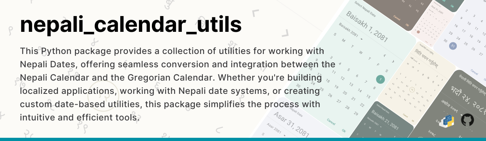

# Nepali Calendar Utilities
<p align="center">
  
</p>

This Python package provides a collection of utilities for working with Nepali Dates, offering seamless conversion and integration between the Nepali Calendar and the Gregorian Calendar. Whether you're building localized applications, working with Nepali date systems, or creating custom date-based utilities, this package simplifies the process with intuitive and efficient tools.

<br>

<p align="center">
  <a href="https://pypi.org/project/nepali_calendar_utils/">
    </a>&nbsp;
  <a href="https://github.com/shivathapaa/nepali_calendar_utils/blob/main/LICENSE">
    </a>
</p>

<br>

> **Note:** If you want to implement date utilities and converters along with UI in your projects, then the library is available on Maven Central as _**io.github.shivathapaa/nepali-date-picker**_. KMP [Nepali Date Picker](https://github.com/shivathapaa/Nepali-Date-Picker) library provides UI for picking date and various utilities to work with Nepali Dates, and acts as a bridge between Nepali Calendar and Gregorian Calendar.

<br>

<details>
  <summary><b>Table of Contents</b></summary>

* [Types/features](#typesfeatures)
* [Installation](#installation)
* [How to use in your project](#how-to-use-in-your-project)
* [Utilities to explore](#utilities-to-explore)
* [Support](#support)
* [License](#license)
</details>

## Types/Features

This package provides variety of features for working with Nepali calendar dates. It is not only limited to date conversion but many utilities that serves its purpose with extended support for date and time.

Few of them are listed below:

- `CustomCalendar` - Calendar which represents both English and Nepali dates.
- `SimpleDate` and  `SimpleTime` - Simple representation of date and time.
- `NepaliMonthCalendar` - Nepali Month Calendar which consists of the month details.
- `NepaliDateLocale` - To control language, dateFormat, weekDayName, and monthName.
- `NepaliCalendarUtilsLang` - Set of supported language (English & Nepali for now).
- `NepaliDateConverter` - Provides utilities for date conversions (english to nepali and vice versa), get formatted date(6), get time, get date-time in ISO 8601 format, calculate days in between two date, and many more.


## Installation

Install the library via PIP:

```bash
pip install nepali_calendar_utils
```

Import in you project

```python
from nepali_calendar_utils import *


# OR, import only required functions
from nepali_calendar_utils.data.custom_calendar import *
from nepali_calendar_utils.calendar_model.nepali_date_converter import NepaliDateConverter
from nepali_calendar_utils.data.nepali_date_locale import NameFormat, NepaliDateFormatStyle, NepaliDateLocale, NepaliCalendarUtilsLang
from nepali_calendar_utils.calendar_model.nepali_calendar_defaults import NepaliCalendarDefaults
```

## How to use in your project

> **Note:** This library uses a `1-based index` where 1 represents Sunday or January/Baisakh, 7 represents Saturday or July/Kartik, and 12 represents December/Chaitra.

<br>

Don't forget about the **DateRange** before using.

You can check this inside library under file nepali_calendar_defaults.py, `NepaliCalendarDefaults.NepaliYearRange` and `NepaliCalendarDefaults.EnglishYearRange`

```python
# This will be changed overtime to support wider dates.
EnglishYearRange= range(1913, 2043)
NepaliYearRange = range(1970, 2100) 
```

### Utilities to explore
Here are some examples to help you get started. The package (NepaliDateConverter Class) itself provides more detailed explanation and examples, so do checkout package's documentation for each property you use.

#### Backbone of this library
```python
# Simple date representation
@dataclass
class SimpleDate:
    year: int
    month: int
    day_of_month: int = 1

# Simple time representation 
@dataclass
class SimpleTime:
    hour: int
    minute: int
    second: int
    nanosecond: int

# Custom Calendar for both English and Nepali dates
@dataclass
class CustomCalendar:
    year: int
    month: int
    day_of_month: int
    era: int  # 1 for AD, 2 for BS
    first_day_of_month: int
    last_day_of_month: int
    total_days_in_month: int
    day_of_week_in_month: int = -1
    day_of_week: int = -1
    day_of_year: int = -1
    week_of_month: int = -1
    week_of_year: int = -1

# Nepali Month Calendar for month details
@dataclass
class NepaliMonthCalendar:
    year: int
    month: int
    total_days_in_month: int
    first_day_of_month: int
    last_day_of_month: int
    days_from_start_of_week_to_first_of_month: int = field(init=False)

# A data holder representing a CustomCalendar and SimpleTime
@dataclass
class CustomDateTime:
    custom_calendar: CustomCalendar
    simple_time: SimpleTime

# Also, there are various extension/conversion function readily available to utilize all of them for one another.
```

#### Get today's date
```python
from nepali_calendar_utils import *

nepali_date_converter = NepaliDateConverter()

# Get today's date
todayNepaliDate = nepali_date_converter.today_nepali_calendar # returns CustomCalendar

todayEnglishDate = nepali_date_converter.today_english_calendar # returns CustomCalendar

# Using conversion/extension function
todaySimpleDate = nepali_date_converter.today_nepali_calendar.to_simple_date() # returns SimpleDate

currentMonth = nepali_date_converter.today_english_calendar.to_nepali_month_calendar() # returns NepaliMonthCalendar
```

#### Get current time
```python
# Get current time
current_time = NepaliDateConverter().current_time # returns SimpleTime
```

#### Date conversions
```python
# Date conversions
nepali_date_converter = NepaliDateConverter()

convertedNepaliDate = nepali_date_converter.convert_english_to_nepali(2021, 6, 21) # returns CustomCalendar

convertedEnglishDate = nepali_date_converter.convert_nepali_to_english(2081, 3, 21) # returns CustomCalendar
```

### Get CustomCalendar for details using Nepali Date
```python
NepaliDateConverter().get_nepali_calendar(2082, 4, 16) # returns CustomCalendar
```

#### Get month details
```python
# Get month details
total_days_in_magh_2081 = NepaliDateConverter().get_total_days_in_nepali_month(2081, 10) # returns 30 (Int)
    
get_complete_details_of_asar_2078_month = NepaliDateConverter().get_nepali_month_calendar(2078, 3) # returns NepaliMonthCalendar
```

#### Add or Subtract number days and get CustomCalendar
```python
# You can adjust a Nepali date by adding or subtracting number of days.
NepaliDateConverter.get_nepali_calendar_after_addition_or_subtraction(..)

# This function calculates the resulting Nepali date after adjusting the provided year,
# month, and day by a given number of days (positive or negative). It handles all months and
# years calculations according to the day adjustment, ensuring correct calculation of Nepali calendar.
# You don't have to worry about the underflow and overflow of days or month or year. It's all handled. ;)

 # Add 10 days to Nepali date 2081-03-15
 val adjustedDate = NepaliDateConverter.get_nepali_calendar_after_addition_or_subtraction(2081, 3, 15, 10)
 print(str(adjustedDate)) # Output: CustomCalendar(year=2081, month=3, day_of_month=25, ...)
 
 # Subtract 5 days from Nepali date 2081-03-15
 val adjustedDate = NepaliDateConverter.get_nepali_calendar_after_addition_or_subtraction(2081, 3, 15, -5)
 print(str(adjustedDate)) # Output: CustomCalendar(year=2081, month=3, day_of_month=10, ...)
 
 # Add 50 days, crossing over to the next month/year
 val adjustedDate = NepaliDateConverter.get_nepali_calendar_after_addition_or_subtraction(2081, 11, 15, 50)
 print(str(adjustedDate)) # Output: CustomCalendar(year=2082, month=1, day_of_month=5, ...)
```

#### Date comparison
```python
# Date comparison

# Returns:
#    - A negative integer if the comparing date is before the given date.
#    - Zero if they are equal.
#    - A positive integer if the comaparing date is after the given date.
todayCalendar = NepaliDateConverter().today_nepali_calendar

compared_dates = NepaliDateConverter.compare_simple_dates(todayCalendar.to_simple_date(), 2090, 2, 12)
compared_calendar_date = NepaliDateConverter.compare_calendar_dates(todayCalendar, todayCalendar) # returns 0
```

#### Get number of days between two dates
```python
# Get number of days between two dates
no_of_days_between_two_nepali_dates = NepaliDateConverter.get_nepali_days_in_between(SimpleDate(1998, 11, 23), SimpleDate(2098, 4, 21))  # returns 36313

no_of_days_between_two_english_dates = NepaliDateConverter.get_english_days_in_between(SimpleDate(2009, 6, 21), SimpleDate(2500, 3, 23)) # returns 179244
```

#### Format date time into ISO 8601 UTC to save date in database or have reference
```python
# Format date time into ISO 8601 UTC to save date in database or have reference for other timezone calculations
nepali_date_converter = NepaliDateConverter()

current_time = nepali_date_converter.current_time
today_english_date = nepali_date_converter.today_english_calendar
today_nepali_date = nepali_date_converter.today_nepali_calendar

formatted_english_date = NepaliDateConverter.format_english_date_nepali_time_to_iso(today_english_date.to_simple_date(), current_time) # returns in format, "2025-01-25T08:26:08.028900Z"
formatted_nepali_date = NepaliDateConverter.format_nepali_datetime_to_iso(today_nepali_date.to_simple_date(), current_time) # returns in format, "2025-01-25T08:26:08.028900Z"
```

#### Convert ISO UTC format to CustomDateTime which represents the CustomCalendar and SimpleTime
```python
# Converts ISO UTC format to CustomDateTime which represents the Nepali CustomCalendar and Nepali SimpleTime
custom_nepali_date_time = NepaliDateConverter.get_nepali_date_time_from_iso_format("2024-09-09T09:00:15Z")
print(custom_nepali_date_time)  # Outputs: CustomDateTime(custom_calendar=CustomCalendar(...), simple_time=SimpleTime(...))

# Converts ISO 8601 UTC format to CustomDateTime which represents the English CustomCalendar and Nepali SimpleTime
custom_english_date_time = NepaliDateConverter.get_english_date_nepali_time_from_iso_format("2024-09-09T09:00:15Z")
print(custom_english_date_time)  # Outputs: CustomDateTime(custom_calendar=CustomCalendar(...), simple_time=SimpleTime(...))
```

#### Format date and time using a Unicode pattern
```python
# Format time using a Unicode pattern
time = NepaliDateConverter.current_time()

result = NepaliDateConverter.format_time_by_unicode_pattern(
    unicode_pattern="hh:mm:ss a",
    time=time,
    language=NepaliCalendarUtilsLang.NEPALI
)  # result: "०२:४५:१५ दिउँसो"

result = NepaliDateConverter.format_time_by_unicode_pattern(
    unicode_pattern="hh:mm:ss A",
    time=time,
    language=NepaliCalendarUtilsLang.ENGLISH
)  # result: "02:45:15 AM"

# Format only Nepali date using a Unicode pattern
nepali_calendar = NepaliDateConverter.today_nepali_calendar()

result = NepaliDateConverter.format_nepali_date_by_unicode_pattern(
    unicode_pattern="EEEE, MMM dd yyyy",
    calendar=nepali_calendar,
    language=NepaliCalendarUtilsLang.NEPALI  # use ENGLISH for English output
)  # result: "सोमबार, भदौ २४ २०८१"

# Format only English date using a Unicode pattern
english_calendar = NepaliDateConverter.today_english_calendar()

result = NepaliDateConverter.format_english_date_by_unicode_pattern(
    unicode_pattern="E, MMM dd yyyy",
    calendar=english_calendar,
    language=NepaliCalendarUtilsLang.ENGLISH  # use NEPALI for Nepali output
)  # result: "Sat, May 24 2025"

# Format full Nepali date and time using a Unicode pattern
nepali_calendar = NepaliDateConverter.today_nepali_calendar()
time = NepaliDateConverter.current_time()

result = NepaliDateConverter.format_nepali_date_time_by_unicode_pattern(
    unicode_pattern="yyyy MMMM dd, EEEE a hh:mm:ss",
    calendar=nepali_calendar,
    time=time,
    language=NepaliCalendarUtilsLang.NEPALI  # use ENGLISH for English output
)  # result: "२०८१ भदौ २४, सोमबार दिउँसो ०२:४५:१५"

# Format full English date and time using a Unicode pattern
english_calendar = NepaliDateConverter.today_english_calendar()
time = NepaliDateConverter.current_time()

result = NepaliDateConverter.format_english_date_time_by_unicode_pattern(
    unicode_pattern="yyyy MMMM dd, EEEE hh:mm:ss A",
    calendar=english_calendar,
    time=time,
    language=NepaliCalendarUtilsLang.ENGLISH  # use NEPALI for Nepali output
)  # result: "2025 May 24, Monday 02:45:15 PM"
```

#### Get names of the weekdays, and month according to your choice
```python
# Get names of the weekdays, and month according to your choice
weekday = NepaliDateConverter.get_weekday_name(2, NameFormat.FULL, NepaliCalendarUtilsLang.NEPALI) # returns "सोमबार"
weekday_english = NepaliDateConverter.get_weekday_name(5, NameFormat.MEDIUM, NepaliCalendarUtilsLang.ENGLISH) # returns Thu

nepali_month_name = NepaliDateConverter.get_month_name(12, NameFormat.FULL, NepaliCalendarUtilsLang.NEPALI) # returns "चैत"
nepali_month_name_in_english = NepaliDateConverter.get_month_name(3, NameFormat.SHORT, NepaliCalendarUtilsLang.ENGLISH) # returns Asa

english_month_name = NepaliDateConverter.get_english_month_name(6, NameFormat.FULL, NepaliCalendarUtilsLang.NEPALI) # returns "जुन"
```

#### Format date to make ready for UI
```python
# Format date to make ready for UI
nepali_date_converter = NepaliDateConverter()

today_english_date = nepali_date_converter.today_english_calendar
today_nepali_date = nepali_date_converter.today_nepali_calendar

custom_locale_format = NepaliDateLocale(
    language = NepaliCalendarUtilsLang.NEPALI,
    date_format = NepaliDateFormatStyle.FULL,
    week_day_name = NameFormat.FULL,
    month_name = NameFormat.FULL
)

nepali_formatted_date = NepaliDateConverter.format_nepali_date_from_calendar(today_nepali_date, custom_locale_format) # returns "शनिबार, माघ १२, २०८१"
nepali_default_formatted_date = NepaliDateConverter.format_nepali_date_from_calendar(today_nepali_date, NepaliCalendarDefaults.DefaultLocale)  # returns "Magh 12, 2081"
today_formatted_date = NepaliDateConverter.format_nepali_date_from_calendar(today_nepali_date, NepaliDateLocale()) # returns "Magh 12, 2081"
simple_formatted_nepali_date = NepaliDateConverter.format_nepali_date(2081, 3, 21, 5, NepaliCalendarDefaults.DefaultLocale) # returns "Asar 21, 2081"
english_formatted_date = NepaliDateConverter.format_english_date_from_calendar(today_english_date, NepaliDateLocale()) # returns "January 25, 2025"
simple_english_formatted_date = NepaliDateConverter.format_english_date(today_english_date.year, today_english_date.month, today_english_date.day_of_month, 7, custom_locale_format) # returns "शनिबार, जनवरी २५, २०२५"
```

#### Format time to make ready for UI
```python
# Format time to make ready for UI
current_time = NepaliDateConverter().current_time

formatted_nepali_time = NepaliDateConverter.get_formatted_time_in_nepali(simple_time = current_time, use_12_hour_format = True) # returns "राति १२ : ०४"
formatted_english_time = NepaliDateConverter.get_formatted_time_in_english(simple_time = current_time, use_12_hour_format = False) # returns "0:04"
```

#### Localize strings to English or Nepali
```python
# Localize strings to English or Nepali
nepali_string = NepaliDateConverter.convert_to_nepali_number("Today is 2024") # returns "Today is २०२४"
nepali_string_with_only_digits = NepaliDateConverter.convert_to_nepali_number("2024") # returns "२०२४"
english_string = NepaliDateConverter.convert_to_english_number("२०२४ सोमबार") # returns "2024 सोमबार"

localize_string_in_nepali = NepaliDateConverter.localize_number("Today is 2024", NepaliCalendarUtilsLang.NEPALI) # returns "Today is २०२४"
localize_string_in_english = NepaliDateConverter.localize_number("२०२४ सोमबार, Monday", NepaliCalendarUtilsLang.ENGLISH) # returns "२०२४ सोमबार, Monday"
```

#### Replace delimiter for displaying or saving as you prefer
```python
# Replace delimiter for displaying or saving as you prefer
original_date = "2024/06/21"
new_delimiter = "-"
formatted_date = NepaliDateConverter.replace_delimiter(original_date, new_delimiter) # returns "2024-06-21"

original_nepali_date = "२०२४/०६/२१"
formatted_nepali_date = NepaliDateConverter.replace_delimiter(original_nepali_date, new_delimiter) # returns "२०२४-०६-२१"

original_time = "09:45 AM"
new_delimiter_space = " "
old_delimiter = ":"
formatted_time_with_space = NepaliDateConverter.replace_delimiter(original_time, new_delimiter_space, old_delimiter) # returns "09 45 AM"
```

And there is always more to explore... ;)

## Support

You can contribute to this project in several ways:

- Have an idea for an improvement or a new feature? I'm open to suggestions! Feel free to suggest changes, request enhancements, or report issues [here](https://github.com/shivathapaa/nepali_calendar_utils/issues/new/choose).
- Share the project with your network to help others discover it.
- Want to contribute directly? You're welcome to open a pull request! Be sure to review the [CONTRIBUTING.md](https://github.com/shivathapaa/nepali_calendar_utils/blob/main/CONTRIBUTING.md) guide before getting started.
- Show your support by giving this repository a Star⭐. It means a lot! 😊

## License

This project is licensed under [Mozilla Public License 2.0 (MPL 2.0)](https://github.com/shivathapaa/nepali_calendar_utils/blob/main/LICENSE)
```
Mozilla Public License 2.0 (MPL 2.0)

This project is licensed under the Mozilla Public License 2.0 (MPL 2.0).
MPL 2.0 is a permissive open-source license that allows you to use, modify,
and distribute the code, provided that any modifications to the MPL-licensed
files are also made available under the same license and shared with the community.
This license ensures that improvements to the code remain open and accessible to the community.
```

```
Additional Modification and Distribution Terms

To ensure that improvements to the core library remain open and benefit
the community, I would like to emphasize the following:

Any modifications made to the files of this Library (the "Covered Software") are
subject to the terms of this License. If you modify the Library, you must make the
source code of your modifications available to all recipients of the modified Library
under the terms of this License.
```
For more details, see the [LICENSE](https://github.com/shivathapaa/nepali_calendar_utils/blob/main/LICENSE) file.


---

Thank you for star! 😉
